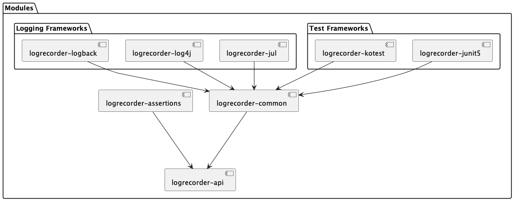

= LogRecorder

== Artifacts

=== API

The `logrecorder-api` artifacts provides the basic components and interfaces for implementing a LogRecord.
On its own this artifact does not provide any functionality.
It must be coupled with an actual implementation.
Programmatic usage is provided with the chosen implementation.
Test framework support requires an additional optional artifact

.Gradle
[source,groovy]
----
testImplementation("io.github.logrecorder:logrecorder-api:${logrecorder.version}")
----

.Maven
[source,xml]
----
<dependency>
    <groupId>io.github.logrecorder</groupId>
    <artifactId>logrecorder-api</artifactId>
    <version>${logrecorder.version}</version>
    <scope>test</scope>
</dependency>
----

=== Framework Support: Junit5

.Gradle
[source,groovy]
----
testImplementation("io.github.logrecorder:logrecorder-junit5:${logrecorder.version}")
----

.Maven
[source,xml]
----
<dependency>
    <groupId>io.github.logrecorder</groupId>
    <artifactId>logrecorder-junit5</artifactId>
    <version>${logrecorder.version}</version>
    <scope>test</scope>
</dependency>
----

=== Framework Support: Kotest

.Gradle
[source,groovy]
----
testImplementation("io.github.logrecorder:logrecorder-kotest:${logrecorder.version}")
----

.Maven
[source,xml]
----
<dependency>
    <groupId>io.github.logrecorder</groupId>
    <artifactId>logrecorder-kotest</artifactId>
    <version>${logrecorder.version}</version>
    <scope>test</scope>
</dependency>
----

=== Implementation: Logback

The `logrecorder-logback` provides everything you need to start recording any link:https://logback.qos.ch[Logback]-based logging activity.

.Gradle
[source,groovy]
----
testImplementation("io.github.logrecorder:logrecorder-logback:${logrecorder.version}")
----

.Maven
[source,xml]
----
<dependency>
    <groupId>io.github.logrecorder</groupId>
    <artifactId>logrecorder-logback</artifactId>
    <version>${logrecorder.version}</version>
    <scope>test</scope>
</dependency>
----

=== Implementation: Log4j

The `logrecorder-log4j` provides everything you need to start recording any link:https://logging.apache.org/log4j/2.x/[Log4j]-based logging activity.

.Gradle
[source,groovy]
----
testImplementation("io.github.logrecorder:logrecorder-log4j:${logrecorder.version}")
----

.Maven
[source,xml]
----
<dependency>
    <groupId>io.github.logrecorder</groupId>
    <artifactId>logrecorder-log4j</artifactId>
    <version>${logrecorder.version}</version>
    <scope>test</scope>
</dependency>
----

=== Implementation: Java Util Logging (JUL)

The `logrecorder-jul` provides everything you need to start recording any link:https://cr.openjdk.java.net/~iris/se/11/latestSpec/api/java.logging/java/util/logging/package-summary.html[JUL]-based logging activity.

.Gradle
[source,groovy]
----
testImplementation("io.github.logrecorder:logrecorder-jul:${logrecorder.version}")
----

.Maven
[source,xml]
----
<dependency>
    <groupId>io.github.logrecorder</groupId>
    <artifactId>logrecorder-jul</artifactId>
    <version>${logrecorder.version}</version>
    <scope>test</scope>
</dependency>
----

=== Assertions

The `logrecorder-assertions` artifacts provides a Kotlin based DSL for asserting the content of log recordings.

.Gradle
[source,groovy]
----
testImplementation("io.github.logrecorder:logrecorder-assertions:${logrecorder.version}")
----

.Maven
[source,xml]
----
<dependency>
    <groupId>io.github.logrecorder</groupId>
    <artifactId>logrecorder-assertions</artifactId>
    <version>${logrecorder.version}</version>
    <scope>test</scope>
</dependency>
----

== Dependencies

== Usage Examples

You can and should use the Kotlin-optimized `logrecorder-assertions` library.
In case that is not possible / to your taste you can also use the raw `logrecorder-api` classes and assert them however
you like.

=== Assertions Library

LogRecorder assertions can be written in multiple styles, depending on your preference.
For these examples we'll be using JUnit.
Examples on how to us other test frameworks are located further down.

==== AssertJ Style

AssertJ uses a fluent `assertThat(value).isEqualTo(otherValue)` style for their assertions.
Based on this style, we provide the `LogRecordAssertion` class and its starting method `assertThat(log: LogRecord)`.

This allows for assertions to be written like:

[source,kotlin]
----
import io.github.logrecorder.api.LogRecord
import io.github.logrecorder.assertion.LogRecordAssertion.Companion.assertThat
import io.github.logrecorder.assertion.containsExactly
import io.github.logrecorder.junit5.RecordLoggers
import org.junit.jupiter.api.Test

@Test
@RecordLoggers(MyService::class)
fun someTest(log: LogRecord) {
    assertThat(log).containsExactly {
        info("some info message")
        warn("and then some warning")
    }
}
----

==== Kotest Style

Kotest Assertions use an infix function `value shouldBe otherValue` style for their assertions.
Based on this style, we provide several `LogRecord` extension functions.

This allows for assertions to be written like:

[source,kotlin]
----
import io.github.logrecorder.api.LogRecord
import io.github.logrecorder.assertion.shouldContainExactly
import io.github.logrecorder.junit5.RecordLoggers
import org.junit.jupiter.api.Test

@Test
@RecordLoggers(MyService::class)
fun someTest(log: LogRecord) {
    log shouldContainExactly {
        info("some info message")
        warn("and then some warning")
    }
}
----

==== Extension Points

The assertion DSL is implemented in a way that allows for a lot of customization / extension of functionality.

===== Custom Message Matchers

[source,kotlin]
----
import io.github.logrecorder.api.LogRecord
import io.github.logrecorder.assertion.LogRecordAssertion.Companion.assertThat
import io.github.logrecorder.assertion.blocks.MessagesAssertionBlock
import io.github.logrecorder.assertion.containsExactly
import io.github.logrecorder.assertion.matchers.MessageMatcher
import io.github.logrecorder.junit5.RecordLoggers
import org.junit.jupiter.api.Test

@Test
@RecordLoggers(MyService::class)
fun someTest(log: LogRecord) {
    assertThat(log).containsExactly {
        info(ofLength(42))
    }
}

// --- simple implementation | usually for one-off assertions inside a single test class ---

fun MessagesAssertionBlock.ofLength(length: Int) =
    MessageMatcher { actual -> actual.length == length }

// --- alternative | for reuse in multiple test classes --

fun MessagesAssertionBlock.ofLength(length: Int) = OfLengthMessageMatcher(length)

class OfLengthMessageMatcher(private val length: Int) : MessageMatcher {
    override fun matches(actual: String): Boolean = actual.length == length
    override fun toString(): String = "lengthOf [$length]"
}
----

===== Custom Exception Matchers

[source,kotlin]
----
import io.github.logrecorder.api.LogRecord
import io.github.logrecorder.assertion.LogRecordAssertion.Companion.assertThat
import io.github.logrecorder.assertion.blocks.MessagesAssertionBlock
import io.github.logrecorder.assertion.containsExactly
import io.github.logrecorder.assertion.matchers.ExceptionMatcher
import io.github.logrecorder.junit5.RecordLoggers
import org.junit.jupiter.api.Test

@Test
@RecordLoggers(MyService::class)
fun someTest(log: LogRecord) {
    assertThat(log).containsExactly {
        warn(exception = listOf(isRuntimeException()))
    }
}

// --- simple implementation | usually for one-off assertions inside a single test class ---

fun MessagesAssertionBlock.isRuntimeException() =
    ExceptionMatcher { actual -> actual is RuntimeException }

// --- alternative | for reuse in multiple test classes --

fun MessagesAssertionBlock.isRuntimeException() = IsRuntimeExceptionMatcher()

class IsRuntimeExceptionMatcher() : ExceptionMatcher {
    override fun matches(actual: Throwable?): Boolean = actual is RuntimeException
    override fun toString(): String = "is RuntimeException"
}
----

===== Custom Property Matchers

[source,kotlin]
----
import io.github.logrecorder.api.LogRecord
import io.github.logrecorder.assertion.LogRecordAssertion.Companion.assertThat
import io.github.logrecorder.assertion.blocks.MessagesAssertionBlock
import io.github.logrecorder.assertion.containsExactly
import io.github.logrecorder.assertion.matchers.PropertyMatcher
import io.github.logrecorder.junit5.RecordLoggers
import org.junit.jupiter.api.Test

@Test
@RecordLoggers(MyService::class)
fun someTest(log: LogRecord) {
    assertThat(log).containsExactly {
        warn(properties = listOf(containsUsername("test-user")))
    }
}

// --- simple implementation | usually for one-off assertions inside a single test class ---

fun MessagesAssertionBlock.containsUsername(username: String) =
    PropertyMatcher { actual -> actual["username"] == username }

// --- alternative | for reuse in multiple test classes --

fun MessagesAssertionBlock.containsUsername(username: String) = ContainsUsernamePropertyMatcher()

class ContainsUsernamePropertyMatcher(private val username: String) : PropertyMatcher {
    override fun matches(actual: Map<String, String>): Boolean = actual["username"] == username
    override fun toString(): String = "username property equal to '$username'"
}
----

===== Custom Assertion Blocks

[source,kotlin]
----
import io.github.logrecorder.api.LogRecord
import io.github.logrecorder.assertion.LogRecordAssertion
import io.github.logrecorder.assertion.LogRecordAssertion.Companion.assertThat
import io.github.logrecorder.assertion.blocks.AssertionBlock
import io.github.logrecorder.junit5.RecordLoggers
import org.junit.jupiter.api.Test

@Test
@RecordLoggers(MyService::class)
fun someTest(log: LogRecord) {
    assertThat(log).isEmpty()
}

fun LogRecordAssertion.isEmpty() = assertBlock(IsEmptyAssertionBlock())

class IsEmptyAssertionBlock : AssertionBlock {
    override fun check(logRecord: LogRecord) {
        if (logRecord.entries.isNotEmpty()) throw AssertionError("...")
    }
}
----

=== JUnit

[source,kotlin]
----
import io.github.logrecorder.api.LogEntry
import io.github.logrecorder.api.LogLevel
import io.github.logrecorder.api.LogRecord
import io.github.logrecorder.api.LogRecord.Companion.logger
import io.github.logrecorder.junit5.RecordLoggers
import org.assertj.core.api.Assertions.assertThat
import org.junit.jupiter.api.BeforeEach
import org.junit.jupiter.api.Test
import java.util.function.Consumer

internal class LogRecorderExtensionTest {

    private val testServiceA = TestServiceA()

    @Test
    @RecordLoggers(TestServiceA::class) // define from which class you want to test log messages
    fun `extension is registered and log messages are recorded`(log: LogRecord) {
        testServiceA.logSomething()
        // assert using one of the provided styles / DSL or manually access the LogRecord's content
    }
}

----

=== Kotest

[source,kotlin]
----
import io.github.logrecorder.api.LogEntry
import io.github.logrecorder.api.LogLevel
import io.github.logrecorder.api.LogRecord.Companion.logger
import io.github.logrecorder.common.kotest.logRecord
import io.github.logrecorder.kotest.recordLogs
import io.kotest.core.spec.style.FunSpec
import org.assertj.core.api.Assertions.assertThat

internal class LogRecorderExtensionTest : FunSpec({

    val testServiceA = TestServiceA()

    test("extension is registered and log messages are recorded").config(
        extensions = listOf(recordLogs(TestServiceA::class))
    ) {
        testServiceA.logSomething()
        // assert using one of the provided styles / DSL or manually access the LogRecord's content
    }
})
----

=== Programmatic

[source,kotlin]
----
import io.github.logrecorder.api.LogEntry
import io.github.logrecorder.api.LogLevel
import io.github.logrecorder.api.LogRecord.Companion.logger
import io.github.logrecorder.common.recordLoggers
import org.assertj.core.api.Assertions.assertThat
import org.junit.jupiter.api.Test

internal class LogRecorderProgrammatic {

    private val testServiceA = TestServiceA()

    @Test
    internal fun `log messages are recorded in lamda an returned`() {
        val logRecord = recordLoggers(TestServiceA::class) { log ->
            testServiceA.logSomething()
            log
        }
        // assert using one of the provided styles / DSL or manually access the LogRecord's content
    }
}
----

=== Java

LogRecorder is written in and for Kotlin.
We did our best to make it as comfortable as possible to use in Java.
But things like our assertions are just not translating.

The main API classes and general test framework and log library integration combined with manual assertions of the
`LogRecord` will work.

[source,java]
----
package io.github.logrecorder.example;

import io.github.logrecorder.api.LogEntry;
import io.github.logrecorder.api.LogLevel;
import io.github.logrecorder.api.LogRecord;
import io.github.logrecorder.api.LogRecord.Companion.logger;
import io.github.logrecorder.assertion.AssertionBlock;
import io.github.logrecorder.assertion.ContainsExactly;
import io.github.logrecorder.junit5.RecordLoggers;
import org.assertj.core.api.Assertions.assertThat;
import org.junit.jupiter.api.BeforeEach;
import org.junit.jupiter.api.Test;

public class LogRecorderExtensionTest {

  private final TestServiceA serviceA = new TestServiceA();

  @Test
  @RecordLoggers({TestServiceA.class}) // define from which class you want to test log messages
  public void testLoggingServiceA(LogRecord log) {
    assertThat(log.getEntries()).isEmpty();

    // TestServiceA and TestServiceB produces logs
    serviceA.logSomething();

    // check only messages
    assertThat(log.getMessages()).containsExactly(
        "trace message a",
        "debug message a",
        "info message a",
        "warn message a",
        "error message a"
    );

    // check message, log level and markers
    assertThat(log.getEntries()).containsExactly(
        new LogEntry(logger(TestServiceA.class), LogLevel.TRACE, "trace message a"),
        new LogEntry(logger(TestServiceA.class), LogLevel.DEBUG, "debug message a"),
        new LogEntry(logger(TestServiceA.class), LogLevel.INFO, "info message a"),
        new LogEntry(logger(TestServiceA.class), LogLevel.WARN, "warn message a"),
        new LogEntry(logger(TestServiceA.class), LogLevel.ERROR, "error message a")
    );
  }
}
----
